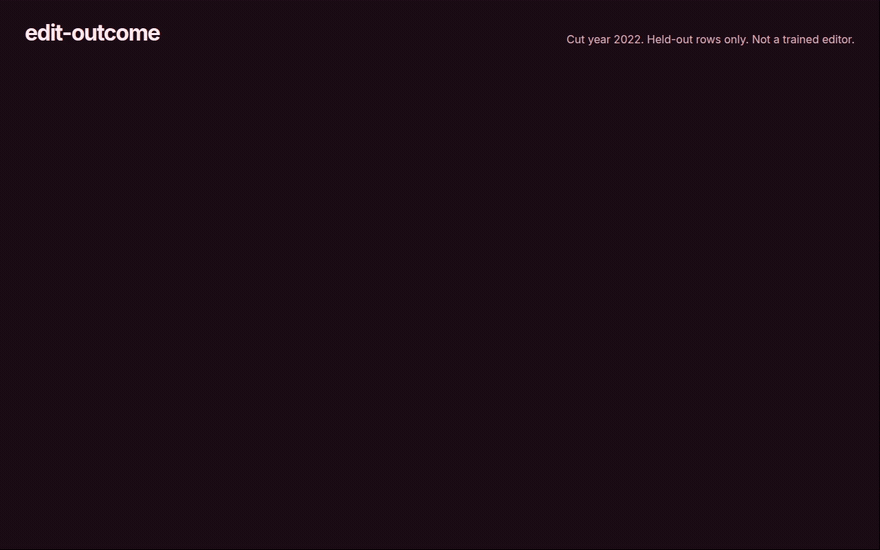

# edit-outcome

**Sequence in, outcome distribution out — with a calibration a reader can check.**

**Status:** problem brief. The question and the measurement are written here. An implementation is not in this repository yet.

---

## Watch

  

The clip plays on this page. [Full video](docs/demo.mp4).

## The problem

Base editors and prime editors do not have one outcome. A target can become the intended allele, a bystander edit, an indel, or unchanged. A single "efficiency" number hides that mix, and a high score gets treated as a certainty it never earned.

Published predictors are useful and often misread. The number is sharp. The calibration — how often a 0.8 actually was an intended edit — is missing, or it was computed on the same sequences the model just saw.

## The measurement I would trust

Predict a distribution, then show whether the distribution was honest on sequences held out by time or by locus family.

| Requirement | What "honest" means |
| --- | --- |
| Outcomes, not one score | Intended, bystander, indel, unchanged — shares that sum to one |
| A held-out cut | Not a random row split inside one experiment |
| Calibration | Predicted share vs observed share, in bins |
| Abstention | A low-confidence call stays low-confidence instead of being rounded into a design decision |

A leaderboard accuracy with no calibration plot is not this result. A demo that always prints the intended allele is not this result.

## What this repository is

The prediction question for base and prime editing, stated so a later model can be judged against it. Related writing on what methods sections actually report lives in [methods-audit](https://github.com/TechieGoku2623/methods-audit). This repository does not ship a trained editor model.

## Author

**Choppa Devasai Pranatheswar** · [LinkedIn](https://www.linkedin.com/in/devasai-pranatheswar)
